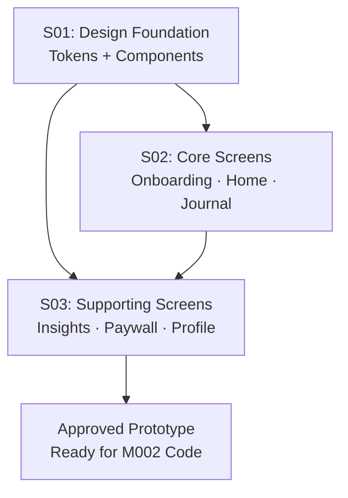
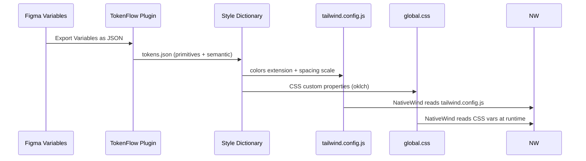

# M001 Design: Design System & Figma Prototype
Date: 2026-03-12

## Architecture Overview



## Slice Breakdown

| Slice | Goal | Produces | Consumes |
|-------|------|----------|----------|
| S01 | Design tokens + component library | Figma Variables, base components, token JSON | Research specs |
| S02 | Core user journey screens | 9 designed screens | S01 components + tokens |
| S03 | All remaining screens + prototype | 7+ screens, click-through prototype | S01 + S02 |

## Screen Inventory

### S02 — Core Screens (9 screens)
| Screen | Description |
|--------|-------------|
| OB-1 | Onboarding: Value prop splash |
| OB-2 | Onboarding: Goal selection (3 cards) |
| OB-3 | Onboarding: Frequency check |
| OB-4 | Onboarding: Time preference |
| OB-5 | Onboarding: Personalized plan preview |
| OB-6 | Onboarding: First value taste (free prompt) |
| OB-7 | Onboarding: Paywall (annual default) |
| HOME | Today screen with mood check-in CTA |
| MOOD | Mood check-in flow (score + label + note) |

### S03 — Supporting Screens (8 screens)
| Screen | Description |
|--------|-------------|
| JOURNAL-LIST | Journal entry list (card layout) |
| JOURNAL-NEW | AI journal session (chat UI) |
| JOURNAL-DETAIL | Entry detail view |
| INSIGHTS | Mood history + streak (Skia graph wireframe) |
| PAYWALL | Full premium upgrade screen |
| PROFILE | User profile + streak stats |
| SETTINGS | Notifications, subscription, data |
| LOGIN | Email/Google sign-in |

## Design Tokens Flow



## Key Design Decisions (from context.md)
- **D002**: Figma-first — no code until design is signed off
- **D009**: App name is Reflect — wordmark in Plus Jakarta Sans SemiBold
- **Color**: Terracotta/amber primary (#E8875A equiv in oklch), warm off-white base
- **Typography**: Plus Jakarta Sans (UI) + Lora (journal content only)
- **Cultural**: Indonesian cultural resonance without religious framing

## Figma File Structure (recommended)
```
Reflect Design System/
  🎨 Foundations/
    Colors (Variables)
    Typography
    Spacing & Grid
    Icons
    Illustrations
  🧩 Components/
    Buttons
    Inputs
    Cards (Journal, Mood)
    Navigation (Tab Bar, Header)
    Overlays (Modals, Sheets)
    Lottie Placeholders
  📱 Screens/
    Onboarding (OB-1 through OB-7)
    Main App (HOME, MOOD, JOURNAL-*)
    Supporting (INSIGHTS, PAYWALL, PROFILE, SETTINGS, LOGIN)
  🔗 Prototype/
    Primary user flow (Onboarding → Home → Journal)
    Secondary flows (Paywall upgrade, Settings)
```
