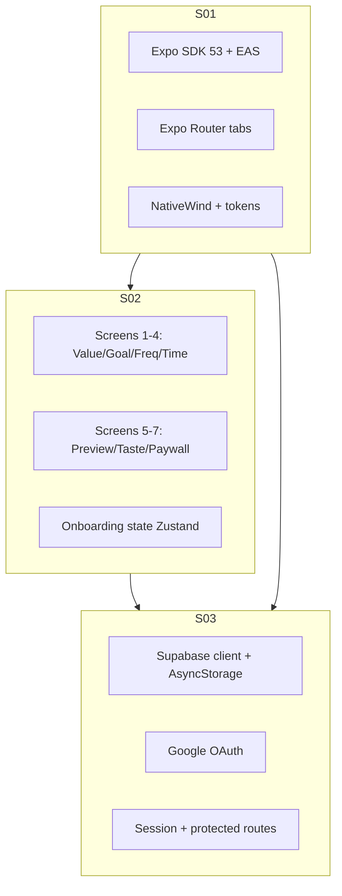
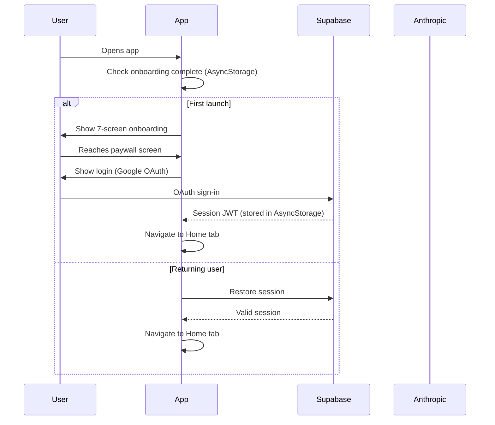

# M002 Design: App Foundation
Date: 2026-03-12

## Architecture Overview



## Slice Breakdown

| Slice | Goal | Produces | Consumes |
|-------|------|----------|---------|
| S01 | Running app on device | Expo project, navigation shell, token system | Nothing — greenfield |
| S02 | Tappable 7-screen onboarding | 7 screen components, onboarding state | S01 navigation shell |
| S03 | Working auth → home | Supabase auth, Google OAuth, protected routes | S01 Supabase client, S02 completion hook |

## Data Flow



## File Structure (end of M002)

```
src/
  app/
    _layout.tsx          ← Root layout: SafeAreaProvider, auth guard
    (tabs)/
      _layout.tsx        ← Tab bar (Today, Journal, Insights, Profile)
      index.tsx          ← Today/Home screen stub
      journal.tsx        ← Journal list stub
      insights.tsx       ← Insights stub
      profile.tsx        ← Profile stub
    onboarding/
      _layout.tsx        ← Onboarding stack navigator
      index.tsx          ← Screen 1: Value prop
      goal.tsx           ← Screen 2: Goal selection
      frequency.tsx      ← Screen 3: Frequency
      time.tsx           ← Screen 4: Time preference
      preview.tsx        ← Screen 5: Plan preview
      taste.tsx          ← Screen 6: Value taste (mini AI demo)
      paywall.tsx        ← Screen 7: Paywall + login trigger
    auth/
      login.tsx          ← Google OAuth + Microsoft login screen
  components/
    ui/
      Button.tsx         ← Primary/Secondary/Ghost variants
      Card.tsx           ← Base card with shadow
      SafeScreen.tsx     ← SafeAreaView wrapper
  lib/
    supabase.ts          ← Supabase client (AsyncStorage adapter)
    constants.ts         ← App-wide constants
  store/
    onboarding.ts        ← Zustand: onboarding answers state
    auth.ts              ← Zustand: auth state
  hooks/
    useAuth.ts           ← Auth state + session restore hook
  types/
    index.ts             ← Shared TypeScript types
```

## Key Design Decisions (from context.md)

- **D001**: Expo Router v3 file-based routing. Tabs at `(tabs)/`. Onboarding as separate stack.
- **D007**: Supabase Singapore region. AsyncStorage adapter — never SecureStore.
- **D003**: All copy in Bahasa Indonesia. No English user-facing strings.
- **Landmine 1**: `metro.config.js` unstable_enablePackageExports: false — first thing after init.
- **Landmine 2**: AsyncStorage for Supabase auth — no exceptions.
- **Landmine 3**: `import 'react-native-url-polyfill/auto'` — first line of entry file.
- **Landmine 8**: SafeAreaView wrapping ALL screens — edge-to-edge Android compliance.

## Auth Flow Decision
Google OAuth only (as per user decision). Microsoft OAuth removed from scope.
Uses `expo-auth-session` + Supabase OAuth provider.
Deep link callback: `reflect://auth/callback`
