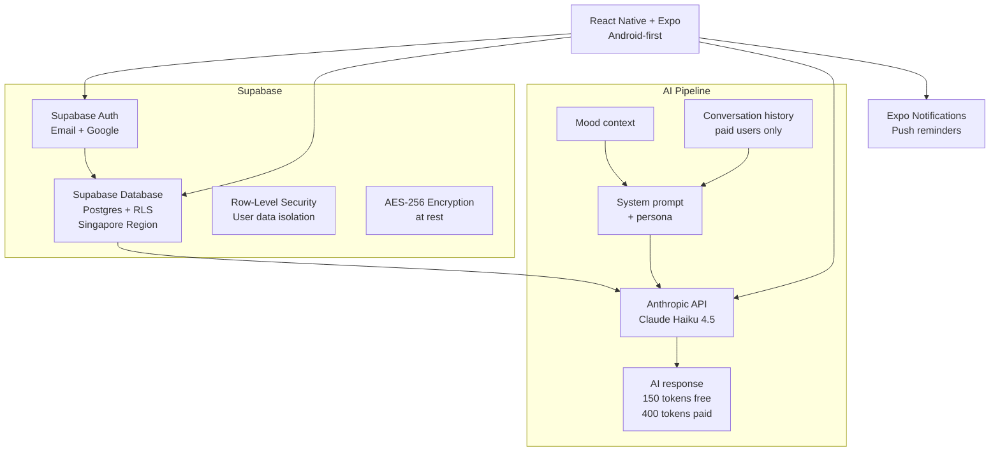

# Architecture Overview — Reflect
Generated: 2026-03-11 | Phase: Discuss

## System Purpose
Reflect is an AI-powered journaling and mood tracking app for Indonesian users. Users do a daily mood check-in, then journal with an AI companion (Claude Haiku 4.5) that responds in warm, casual Bahasa Indonesia. The AI remembers past entries for paid users, creating emotional continuity and attachment.

## High-Level Architecture



## Technology Stack

| Layer | Technology | Reason |
|-------|-----------|--------|
| Mobile framework | React Native + Expo | Solo-builder speed, push notifications, Android+iOS from one codebase |
| Navigation | Expo Router | File-based routing, shared element transitions |
| Styling | NativeWind v4 | Tailwind tokens in React Native, fast design system implementation |
| Animations | Reanimated 3 + Skia | 60/120fps native-thread animations, custom visual components |
| Micro-animations | Lottie | Pre-built celebration/feedback animations |
| Backend + Auth | Supabase | Replaces backend + DB + auth for solo builder. Singapore region. |
| Database | Postgres (via Supabase) | Row-level security, relational data model, free tier |
| AI companion | Claude Haiku 4.5 | Best emotional IQ per dollar. Bahasa Indonesia quality. |
| Push notifications | Expo Notifications + FCM | Reliable Android push for daily reminders |
| Design tool | Figma | Design system + all screens before any code |

## Key Technical Decisions
- **D001**: React Native + Expo, Android-first (push notifications critical for habit loops)
- **D002**: Figma-first design (beauty is the product, visual iteration beats code iteration)
- **D007**: Supabase Singapore region (PDP Law compliance, low latency Indonesia)
- **D008**: Claude Haiku 4.5 (97% LLM margin at Rp 39.000/month pricing)

## Data Model (Conceptual)

```
users
  id, email, created_at, subscription_tier (free/paid), subscription_expires_at

mood_checkins
  id, user_id, mood_score (1-10), mood_label, context_note, created_at

journal_entries
  id, user_id, content (encrypted), mood_checkin_id, created_at

ai_conversations
  id, user_id, journal_entry_id, messages (JSONB), created_at

user_streaks
  id, user_id, current_streak, longest_streak, last_active_date
```

## AI Pipeline

```
1. User completes mood check-in (score + label + optional note)
2. User opens journal
3. AI greeting generated using mood context
4. User writes journal entry
5. AI response generated:
   - System prompt: warm friend persona + Bahasa Indonesia
   - Context: today's mood + [last 10 sessions if paid]
   - Max tokens: 150 (free) / 400 (paid)
6. Conversation continues (up to 5 exchanges per session)
7. Session summary saved to Supabase
```

## Boundaries — What Reflect Does NOT Do
- No therapist matching or professional referrals (v2+)
- No social/community features
- No wearable integrations
- No habit tracking (deferred)
- No sleep tracking (deferred)
- No iOS at launch (post-Android validation)
- No English/multilingual at launch (post-Indonesia success)
